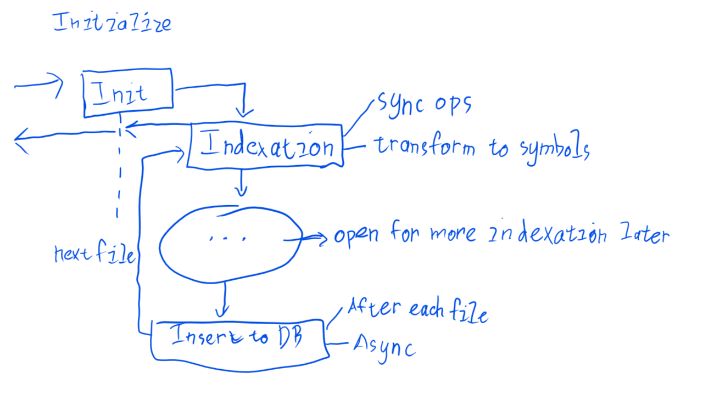

# 22 July 2018
## Initialize workflow:

## Initial thought on references:
- Have type property
- Type will be resolved during querying time, a few reasons:
    - Looking for types must be after indexation process, when all symbols are indexed.
    - Types need to be resolved by looking up database which can be async, so await operation will slow down this process.
    - Language server querying is async
    - Potential problems:
        - The process is long which causes delay