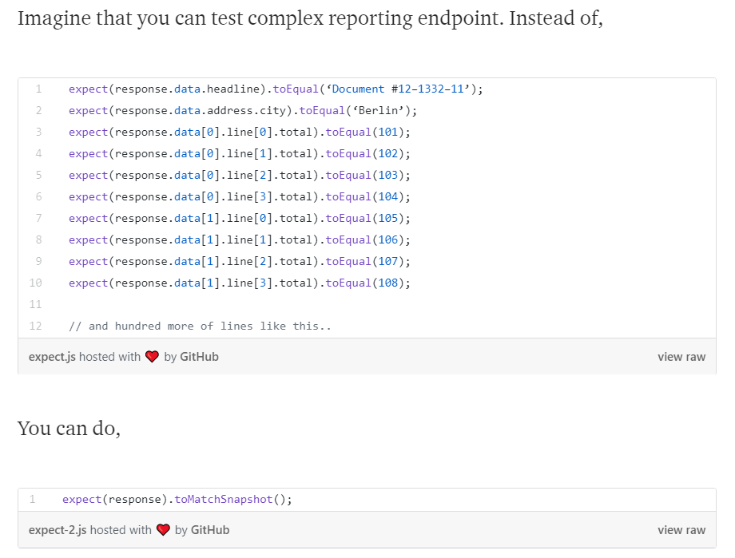

# 5 August 2018
## Jest as test framework
- Snapshot testing is an efficient way to test object without writing code for each property
- Demonstrated by Alexander Beletsky at [medium.com](https://medium.com/blogfoster-engineering/how-to-use-the-power-of-jests-snapshot-testing-without-using-jest-eff3239154e5) 

**Challenges**

A few challenges appear when Jest is used
1. ts-jest does not support const enum and [php7parser](https://github.com/bmewburn/php7parser) is using that for PhraseType and TokenType
2. Some of the valuable properties are not captured due to the use of getters. e.g. type of constants, value of constants
3. Some properties are captured but might be different depending on the environment. e.g. URI of a document is definitely different on different machines.
4. Invaluable properties are captured which can noise the snapshot and reduce readability.

**Current solutions**

1. Because PhraseType and TokenType are numbers in their nature, therefore 2 non-const enums are created whose values are exactly the same called PhraseKind and TokenKind, and convert PhraseType, TokenType to PhraseKind and TokenKind
    - This might not be a good idea since php7parser v2 rename them to PhraseKind and TokenKind, but for now they work
2. Introduce a ```toObject()``` function that can be included in any object which returns a generic object
    - Use the function ```createObject(constructor: any): any``` for that purpose
    - Since the function receives a ```constructor``` parameter it also helps the snapshot to include name which is more readable
3. For now, URIs are converted to relative path to the project, this is possible thanks to the function ```toObject()```
4. Also thanks to ```toObject()``` noisy properties can be removed